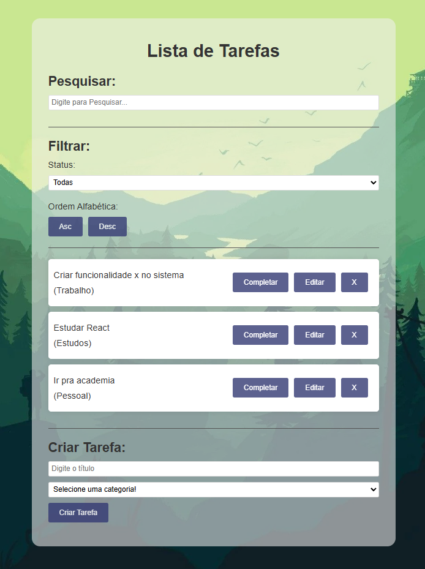

# Todo React App 


### Este é um aplicativo de lista de tarefas desenvolvido em React, que permite aos usuários adicionar, completar, editar, pesquisar e remover tarefas de forma interativa.


## Demonstração:


### Funcionalidades:
Adicionar Tarefa: Permite aos usuários adicionar novas tarefas com categorias.
Completar/Incompletar Tarefa: Marca uma tarefa como completa ou incompleta com um clique.
Editar Tarefa: Permite editar o título ou a categoria de uma tarefa existente.
Remover Tarefa: Remove uma tarefa da lista de tarefas.
Instalação e Execução


## Para clonar e executar este projeto localmente, siga estas etapas:
### Clone o repositório:

```Bash

git clone https://github.com/mbdxd/todo_mig.git
cd todo_react/todo_mig
```

### Instale as dependências:

```Bash
npm install
```
### Inicie o servidor de desenvolvimento:


```bash
npm start
```


## Uso
#### Adicionar uma Tarefa
Digite o título da tarefa no campo de texto.
Selecione a categoria da tarefa.
Clique em "Criar Tarefa" para adicionar a tarefa à lista.
Completar/Incompletar uma Tarefa
Clique no botão "Completar/Incompleto" para marcar a tarefa como completa ou incompleta.

#### Editar uma Tarefa
Clique no botão "Editar" para editar o título ou a categoria de uma tarefa existente.

#### Remover uma Tarefa
Clique no botão "X" para remover uma tarefa da lista.

## Tecnologias Utilizadas
React - Biblioteca JavaScript para criar interfaces de usuário.<br>
npm - Gerenciador de pacotes para JavaScript.<br>
Node.js - Ambiente de execução JavaScript.
## Contribuição
Contribuições são bem-vindas! Se você quiser contribuir com este projeto, siga estas etapas:

Faça um fork do projeto.<br>
Crie uma nova branch (git checkout -b feature/nova-funcionalidade).<br>
Faça commit das suas alterações (git commit -am 'Adiciona nova funcionalidade').<br>
Faça push para a branch (git push origin feature/nova-funcionalidade).<br>
Abra um Pull Request.

### Licença
Este projeto é licenciado sob a licença MIT. Veja o arquivo LICENSE para mais detalhes.

## Contato:
Miguel Guimarães - [LinkedIn](https://www.linkedin.com/in/miguelsb/)

Link do Projeto: https://github.com/mbdxd/todo_mig
